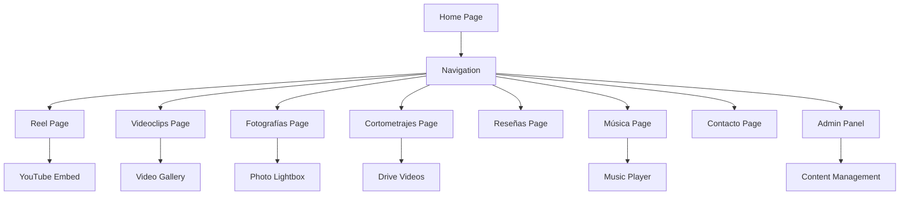

## 1. Product Overview
Migración completa del portafolio audiovisual "portafolioaero" de HTML/CSS/JavaScript vanilla a una aplicación React + Vite con arquitectura moderna. El proyecto mantiene la estética Frutiger Aero/Glassmorphism característica mientras implementa una arquitectura de componentes reutilizables y estado centralizado.

El portafolio es un showcase multimedia para Hugo Jaque que incluye videoclips, cortometrajes, fotografías, reseñas críticas y un reproductor de música integrado, todo gestionado desde un panel de administración conectado a Firebase.

## 2. Core Features

### 2.1 User Roles
| Role | Registration Method | Core Permissions |
|------|---------------------|------------------|
| Visitor | No registration required | Browse all content, play music, view videos/photos |
| Admin | Email/password via Firebase Auth | Full CRUD operations on all content, upload files |

### 2.2 Feature Module
El portafolio consta de las siguientes páginas principales:
1. **Home page**: Hero section con bienvenida, perfil del artista, navegación principal.
2. **Reel page**: Feed vertical de videos de YouTube con reproducción automática al hacer scroll.
3. **Videoclips page**: Galería de videoclips musicales con reproductor embebido.
4. **Fotografías page**: Galería de imágenes con lightbox y navegación por teclado.
5. **Cortometrajes page**: Showcase de cortometrajes con reproductor Drive.
6. **Reseñas page**: Lista de reseñas críticas con diseño de tarjetas.
7. **Música page**: Reproductor de música completo con playlist, controles de reproducción y gestión de canciones.
8. **Contacto page**: Información de contacto y enlaces a redes sociales.
9. **Admin Panel**: Panel de administración para gestionar todo el contenido del sitio.

### 2.3 Page Details
| Page Name | Module Name | Feature description |
|-----------|-------------|---------------------|
| Home page | Hero section | Mostrar título dinámico y subtítulo desde Firebase, animación de entrada con blur y scale. |
| Home page | Profile section | Mostrar foto de perfil y descripción biográfica desde Firebase, transición de opacidad suave. |
| Home page | Navigation | Sidebar fijo con botones glassmorphism, menú móvil desplegable, efectos hover con sonido. |
| Reel page | Video Feed | Scroll infinito de videos de YouTube, reproducción automática basada en intersección, controles de navegación. |
| Videoclips page | Video Gallery | Grid responsivo de videoclips, iframe embebido de YouTube/Vimeo, títulos dinámicos desde Firebase. |
| Fotografías page | Photo Gallery | Grid de imágenes con lightbox modal, navegación por teclado (flechas/escape), transiciones suaves. |
| Cortometrajes page | Short Films | Lista de cortometrajes con reproductores de Google Drive, carga diferida con facades. |
| Reseñas page | Reviews List | Tarjetas de reseñas críticas con diseño glassmorphism, contenido dinámico desde Firebase. |
| Música page | Music Player | Reproductor completo con playlist, barra de progreso, volumen, shuffle, repeat, visualización de carátulas. |
| Contacto page | Contact Info | Información de contacto con enlaces a Instagram/WhatsApp, íconos de redes sociales. |
| Admin Panel | Content Management | CRUD completo para todo el contenido, upload de archivos a Cloudinary, gestión de usuarios. |

## 3. Core Process

### Visitor Flow
1. El visitante accede al sitio y ve la página de inicio con contenido dinámico cargado desde Firebase.
2. Puede navegar por las diferentes secciones usando el sidebar o menú móvil.
3. En la sección de música, puede reproducir canciones con el reproductor integrado.
4. En reel, puede hacer scroll para ver videos con reproducción automática.
5. En galerías de fotos/videos, puede abrir lightboxes para ver contenido ampliado.

### Admin Flow
1. El admin accede al panel de administración mediante autenticación de Firebase.
2. Puede crear, editar y eliminar contenido de cualquier sección.
3. Puede subir nuevas imágenes/videos a través de Cloudinary.
4. Puede gestionar la playlist de música y actualizar información del perfil.

## 4. User Interface Design

### 4.1 Design Style
- **Primary Color**: #0df2f2 (cyan brillante)
- **Secondary Colors**: #f5f8f8 (fondo claro), #102222 (fondo oscuro)
- **Button Style**: Glassmorphism con bordes redondeados, efectos hover con glow cian
- **Typography**: Inter, Segoe UI, Tahoma, sans-serif
- **Border Radius**: 1rem (default), 2rem (lg), 3rem (xl)
- **Icon Style**: Material Symbols Outlined, color blanco con sombras
- **Effects**: CRT overlay, scanlines, glass panels con backdrop blur

### 4.2 Page Design Overview
| Page Name | Module Name | UI Elements |
|-----------|-------------|-------------|
| Home page | Hero section | Glass panel con gradiente cian, blur de 80px, tipografía bold con drop-shadow |
| Home page | Profile section | Rounded avatar de 112px, borde blanco/20, texto con opacidad 70% |
| Navigation | Sidebar | Ancho fijo 256px, fondo negro/20, botones con hover glow cian |
| Reel page | Video container | Full viewport height, snap scroll, controles superpuestos |
| Music player | Player UI | CD spinning animation, progress bar glassmorphism, controles cian |
| Admin panel | Forms | Bootstrap 5 con glassmorphism overlay, loading states |

### 4.3 Responsiveness
- **Desktop-first**: Diseño optimizado para pantallas grandes (1600px max-width)
- **Mobile adaptive**: Menú hamburguesa, contenido full-width, botones táctiles grandes
- **Touch optimization**: Botones mínimo 44x44px, gestos de swipe en reel

### 4.4 Special Effects
- **CRT Effect**: Overlay con scanlines y flickering para estética retro
- **Glassmorphism**: Paneles translúcidos con backdrop blur y bordes brillantes
- **Sound Effects**: Sonidos hover/click estilo Windows XP/MSN Messenger
- **Cursor Custom**: Cursor Windows Classic personalizado para toda la interfaz