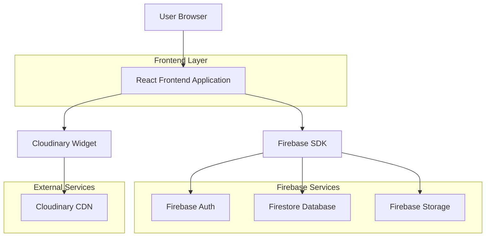

## 1. Architecture design



## 2. Technology Description
- **Frontend**: React@18 + Vite + TailwindCSS@3
- **Initialization Tool**: vite-init
- **State Management**: React Context + useReducer
- **Routing**: React Router DOM@6
- **Backend**: Firebase (Auth, Firestore, Storage)
- **File Upload**: Cloudinary Widget
- **Styling**: TailwindCSS con clases custom para glassmorphism
- **Icons**: Material Symbols Outlined
- **Audio**: HTML5 Audio API
- **Video**: YouTube Embed API, Vimeo Player API

## 3. Route definitions
| Route | Purpose |
|-------|---------|
| / | Home page con hero y perfil del artista |
| /reel | Feed vertical de videos de YouTube |
| /videoclips | Galería de videoclips musicales |
| /fotografias | Galería de fotografías con lightbox |
| /cortometrajes | Showcase de cortometrajes |
| /resenas | Lista de reseñas críticas |
| /musica | Reproductor de música completo |
| /contacto | Información de contacto |
| /admin | Panel de administración (protegido) |
| /login | Página de autenticación para admin |

## 4. Component Architecture

### 4.1 Core Components
```
src/
├── components/
│   ├── layout/
│   │   ├── Header.jsx
│   │   ├── Sidebar.jsx
│   │   ├── MobileMenu.jsx
│   │   └── Footer.jsx
│   ├── ui/
│   │   ├── GlassPanel.jsx
│   │   ├── GlossyButton.jsx
│   │   ├── CRTOverlay.jsx
│   │   └── LoadingSpinner.jsx
│   ├── media/
│   │   ├── MusicPlayer.jsx
│   │   ├── VideoGallery.jsx
│   │   ├── PhotoGallery.jsx
│   │   ├── ReelFeed.jsx
│   │   └── Lightbox.jsx
│   └── admin/
│       ├── ContentManager.jsx
│       ├── FileUploader.jsx
│       └── LoginForm.jsx
├── contexts/
│   ├── AuthContext.jsx
│   ├── MusicContext.jsx
│   └── ContentContext.jsx
├── hooks/
│   ├── useFirestore.js
│   ├── useStorage.js
│   └── useAudio.js
├── services/
│   ├── firebase.js
│   ├── cloudinary.js
│   └── youtube.js
└── styles/
    ├── globals.css
    ├── glassmorphism.css
    └── crt-effects.css
```

### 4.2 State Management Structure
```javascript
// Auth Context
const authState = {
  user: null,
  isAdmin: false,
  loading: true,
  error: null
};

// Music Context
const musicState = {
  currentSong: null,
  playlist: [],
  isPlaying: false,
  volume: 0.8,
  shuffle: false,
  repeat: 'none', // 'none' | 'all' | 'one'
  currentTime: 0,
  duration: 0
};

// Content Context
const contentState = {
  homeContent: {},
  videos: [],
  photos: [],
  music: [],
  reviews: [],
  loading: false,
  error: null
};
```

## 5. Firebase Integration

### 5.1 Firestore Collections Structure
```javascript
// Collection: web
{
  inicio: {
    tituloPrincipal: string,
    subtituloPrincipal: string,
    tituloPerfil: string,
    descripcionPerfil: string,
    url_foto_perfil: string
  }
}

// Collection: contenido
{
  musica: {
    listaCanciones: [{
      titulo: string,
      artista: string,
      url_audio: string,
      url_portada: string
    }]
  },
  videos: {
    items: [{
      titulo: string,
      url: string,
      tipo: 'youtube' | 'vimeo'
    }]
  },
  fotos: {
    items: [{
      titulo: string,
      url: string,
      thumbnail: string
    }]
  },
  resenas: {
    items: [{
      titulo: string,
      contenido: string,
      autor: string,
      fecha: timestamp
    }]
  },
  reel: {
    playlist: [{
      videoId: string,
      titulo: string
    }]
  }
}
```

### 5.2 Security Rules
```javascript
// Firestore Security Rules
rules_version = '2';
service cloud.firestore {
  match /databases/{database}/documents {
    // Read access for all users
    match /web/{document=**} {
      allow read: if true;
      allow write: if request.auth != null;
    }
    
    match /contenido/{document=**} {
      allow read: if true;
      allow write: if request.auth != null;
    }
  }
}
```

## 6. Migration Strategy

### 6.1 CSS Preservation
- Migrar todos los estilos CSS existentes a módulos CSS o styled-components
- Mantener efectos CRT, glassmorphism y animaciones exactamente iguales
- Preservar cursor personalizado y efectos de sonido
- Convertir clases de Tailwind inline a clases CSS custom para mantener consistencia

### 6.2 JavaScript Logic Conversion
- **DOM Manipulation** → React Hooks (useState, useEffect, useRef)
- **Event Listeners** → React event handlers (onClick, onMouseEnter, etc.)
- **Global functions** → Custom hooks y funciones de utilidad
- **Module pattern** → React components y custom hooks

### 6.3 Audio/Video Management
```javascript
// Custom Hook para Audio
const useAudio = (src) => {
  const [audio] = useState(new Audio(src));
  const [playing, setPlaying] = useState(false);
  const [volume, setVolume] = useState(0.8);
  const [currentTime, setCurrentTime] = useState(0);
  const [duration, setDuration] = useState(0);
  
  useEffect(() => {
    audio.volume = volume;
  }, [volume]);
  
  const play = () => {
    audio.play().then(() => setPlaying(true));
  };
  
  const pause = () => {
    audio.pause();
    setPlaying(false);
  };
  
  return { play, pause, playing, setVolume, currentTime, duration };
};
```

### 6.4 Environment Variables
```bash
# .env
VITE_FIREBASE_API_KEY=your_api_key
VITE_FIREBASE_AUTH_DOMAIN=your_auth_domain
VITE_FIREBASE_PROJECT_ID=your_project_id
VITE_FIREBASE_STORAGE_BUCKET=your_storage_bucket
VITE_FIREBASE_MESSAGING_SENDER_ID=your_sender_id
VITE_FIREBASE_APP_ID=your_app_id
VITE_CLOUDINARY_CLOUD_NAME=your_cloud_name
VITE_CLOUDINARY_UPLOAD_PRESET=your_upload_preset
```

## 7. Performance Optimization

### 7.1 Code Splitting
- Lazy loading de rutas de administración
- Dynamic imports para componentes pesados (MusicPlayer, VideoGallery)
- Preload de recursos críticos (fuentes, imágenes principales)

### 7.2 Image Optimization
- Uso de Cloudinary para transformaciones automáticas
- Implementación de lazy loading con Intersection Observer
- Generación de múltiples tamaños de imagen responsivos

### 7.3 Caching Strategy
- Service Worker para assets estáticos
- Cache de Firebase en localStorage para contenido no crítico
- Optimización de re-renders con React.memo y useMemo

## 8. Deployment Configuration

### 8.1 Build Optimization
```javascript
// vite.config.js
export default defineConfig({
  plugins: [react()],
  build: {
    rollupOptions: {
      output: {
        manualChunks: {
          'firebase': ['firebase/app', 'firebase/auth', 'firebase/firestore'],
          'ui-components': ['./src/components/ui'],
          'media-components': ['./src/components/media']
        }
      }
    }
  }
});
```

### 8.2 Hosting Requirements
- Firebase Hosting para frontend
- Cloudinary CDN para assets multimedia
- Configuración de headers de seguridad
- HTTPS